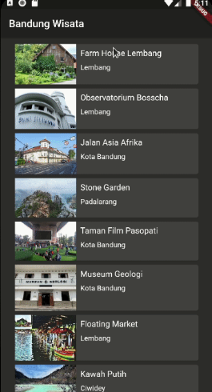

# Tour Place App

## Description

-------

A Multi-Platform Application that written in Dart Language with Flutter Framework that used to showing various tourism attraction places and their details.
This project is based on my training on Dicoding, but it has many major improvements in it's features.

**DISCLAIMER**: the contents (about the place) in the app are not necessarily true, just being a mock up content.

## Features

-------
Here are several feature in the application that already shown in the tutorial

1. Basic list/collection page that lists all of the places.

    

2. Detail page that shows detail of the place.

    

3. Feature to give favorite to the place.

As I mentioned above, there are some big improvements that I create.

1. Adding Home page that have two menu option, view place and exit.

    

    And when the exit button triggered.

    

2. Restyle the collection/list page, the color and now has search option (in right-side of appbar) and show the favorite/love status.

    

3. Restyle the detail page, the color and now has rating feature.

    

4. Search functionality to search places in the list.

    

5. Now has state management between page, so as long app still active, the favorite & rating will persist.

6. Project has better structure, so it's now more easily to be developed.

7. ***Under Development*** - Auto sort list by it's favorite/love status, so the favorite one will shown on top of the list. Because of the bugs, the feature now still being disabled.

## Credits
-------

1. [Naufal Prima Yoriko](https://github.com/primayoriko)
